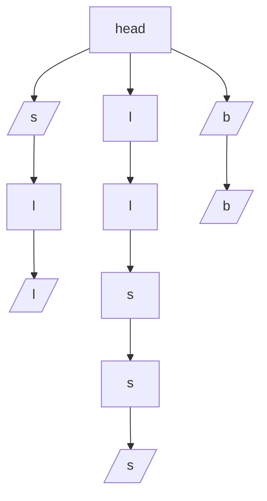

博客地址：https://littlefish33.cn/LeetCode/PalindromePairs/

# Description

[原题地址](https://leetcode.com/problems/palindrome-pairs/description/)

Description：Given a list of **unique** words, find all pairs of **distinct** indices `(i, j)` in the given list, so that the concatenation of the two words, i.e. `words[i] + words[j]` is a palindrome.

**Example 1:**  

```
Input: ["abcd","dcba","lls","s","sssll"]
Output: [[0,1],[1,0],[3,2],[2,4]] 
Explanation: The palindromes are ["dcbaabcd","abcddcba","slls","llssssll"]
```

**Example 2:**

```
Input: ["bat","tab","cat"]
Output: [[0,1],[1,0]] 
Explanation: The palindromes are ["battab","tabbat"]
```

题目的要求就是给一组字符串，然后要求你用这组字符串中选取两两组合，结果是回文。

# 方法一

弱弱的我一开始想到的自然就是暴力搜索，结果很自然的就`TLE`了。

通过在讨论区看了一下之后，发现主要的思路是：

遍历整个字符串组，如果能找到两两结合之后是回文的字符串对，主要有一下情况：

- 将当前字符串拆分为两个部分：left和right

```c++
// left: 空串到整个字符串
// right: 整个字符串到空串 
left = words[i].substr(0,j);
right=words[i].substr(j, words[i].size()-j);
```

- 如果该字符串 + 另一个字符串能构成回文，那么`right`为回文，即`left + right + word2`构成一个回文对，此时在字符串组里查找是否存在`word2` 等于`left`反转后的结果
  - 下面的`reverse_map`保存着所有字符串反转后的结果
  - 同时我们要避免一个字符串使用两次：`reverse_map[left] != i`

```c++
if(is_Palindrome(right)){
	if(reverse_map.find(left) != reverse_map.end() && reverse_map[left] != i){
		ans.push_back({i,reverse_map[left]});
	}
}
```

- 同理对`word2 + left + right` 的情况进行分析：
  - 这里需要避免出现的重复对

下面的例子用`left|right+word2`表示组成的字符串，假设两个单词：words[0] = "abc", words[1] = "cba"：

第一种情况：`abc|null + cba` ：{0,1}对

第二种情况：`abc + null|cba` ：{0,1}对

我们只对第一种情况计数，以避免重复的对。

```c++
if(is_Palindrome(left)){
	//left != "" 避免重复的对
	if(reverse_map.find(right) != reverse_map.end() && reverse_map[right] != i && left != ""){
		ans.push_back({reverse_map[right],i});
	}
}
```

程序源代码：

```c++
class Solution {
public:
    vector<vector<int>> palindromePairs(vector<string>& words) {
        unordered_map<string,int> reverse_map;
        string reverseStr; 
        //先将所有字符串反转后的结果保存起来，便于之后查找 
        for(int i = 0;i < words.size();i++){
        	reverseStr = words[i];
        	reverse(reverseStr.begin(),reverseStr.end());
        	reverse_map.insert({reverseStr,i});
		}

		vector<vector<int>> ans;
		string left,right;
		for(int i = 0;i < words.size();i++) {
			for(int j = 0; j <= words[i].size();j++){
				// 将当前字符串拆分为两个部分：left和right
				// left: 空串到整个字符串
				// right: 整个字符串到空串 
				left = words[i].substr(0,j);
				right=words[i].substr(j, words[i].size()-j);
				/*
				如果该字符串 + 另一个字符串能构成回文，那么right为回文，即left + right + word2构成一个回文对，
				此时在字符串组里查找是否存在 word2 等于left反转后的结果
				*/
				if(is_Palindrome(right)){
					if(reverse_map.find(left) != reverse_map.end() && reverse_map[left] != i){
						ans.push_back({i,reverse_map[left]});
					}
				}
				/*
				* 同理对 word2 + left + right 进行分析 
				*/ 
				if(is_Palindrome(left)){
					//left != "" 避免重复的对
					if(reverse_map.find(right) != reverse_map.end() && reverse_map[right] != i && left != ""){
						ans.push_back({reverse_map[right],i});
					}
				}
			}
		}
		return ans;
    }
    
    bool is_Palindrome(string& str){
    	int begin = 0,end = str.size()-1;
    	while(begin < end)	{
    		if(str[begin] != str[end]){
    			return false;
			}
			begin++;
    		end--;
		}
		return true;
	}
    
};
```


# 方法二

该题还有另一种解法就是使用Trie字典树

首先，将所有字符串的反转后的结果放在字典树中；

假设我们有字符串组： `words = [ "lls", "sssll", "s", "bb", "b" ]`，此时我们构造出来的反转字典树如下图所示：

其中，`/s/`表示该节点为一个字符串的结尾



然后对于每一个字符串，在字典树中搜索：

**第一种情况**

在查找与字符串`lls`匹配的回文对时，我们需要跟踪节点**l - l - s**。我们可以说，**如果我们没有访问的其他节点是回文，那么我们可以得到回文。**在这种情况下，我们有两个未访问的节点**s - (s)**，它们形成回文，所以我们可以得到回文`lls + sssll`。

同理，如果我们想要找到与`s`匹配的回文对，我们需要遵循的节点**(s)- l - l**。未访问的节点是**l - l**，它形成回文，所以我么可以得到回文`s + lls`

**第二种情况**

在查找与字符串`b`匹配的回文对时，通过上面第一种情况的做法我们可以得到回文`b + bb`，但是在查找字符串`bb`匹配的回文对时，第一种情况却得不到回文`bb + b`

因此我们需要对此情况另外分析，即我们搜索过程中如果遇到某节点是其他字符串的结尾，那么我们就可以判断当前搜索的字符串剩下的部分是不是回文，如果是，那么就可以得到回文；

如上面的例子，假设搜索的字符串`word = "bb"`，当我们搜索到`word[0]`的时候，发现`b`节点正好是字符串`b`的结尾（如上图中head下面的`b`节点为`/b/`），此时判断word剩下的部分`b`，正好为回文，说明符合情况

**第三种情况**

提前对空串进行分析


程序源代码：

```c++
// 字典树节点 
class TrieNode
{
public:
	TrieNode(char v = ' '){
		value = v;
		end = -1;
	};
	~TrieNode(){}
	unordered_map<char,TrieNode*> next;
	char value;
	int end; // 用于返回结尾的单词的编号是多少 
};

// 字典树类 
class Trie {
public:
    Trie() {
        head = new TrieNode();
    }
    
    ~Trie() {
        deleteNode(head);
    }
    
    void deleteNode(TrieNode* node){
    	if(node == nullptr){
    		return;
		}
		for(auto& n :node->next){
			deleteNode(n.second);
		}
		delete node;
	}
    
    // 插入节点 
    void insert(string word,int index) {
    	TrieNode* temp,*node = head;
        for(int i = 0;i < word.size();i++){
        	if(node->next.find(word[i]) == node->next.end()){
        		temp = new TrieNode(word[i]);
        		node->next[word[i]] = temp;
        		node = temp;
			}
			else{
				node = node->next[word[i]];
			}
		}
		node->end = index;
    }
    
    // 搜索匹配的回文对 
    vector<int> search(string word) {
        TrieNode* node = head;
        vector<int> ans;
        // 遍历字符串 
        for(int i = 0;i < word.size();i++){
        	// 搜索不到 
        	if(node->next.find(word[i]) == node->next.end()){
        		return ans;
			}
			// 搜素到，进入下一个字符 
			else{
				node = node->next[word[i]];
				if(node->end != -1){
				/*
				 考虑 "bb","b"的情况，此时存在：
				 		head
				 		 |
				 		 (b)
				 		 |
				 		 (b)
				 当word = "bb"的时候， 搜索到word[0]时，判断剩下的字符串 "b" 为 回文，
				 故 bb + b 为匹配的回文结果 
				 */
					if(i != word.size()-1 && is_Palindrome(word,i+1)){
						ans.push_back(node->end);
					}
				}
			}
		}
		// 搜索剩下的节点 
		searchRestNode(ans,node,"");
		return ans;
    }
    
    // 搜索一个节点剩下的节点 
    void searchRestNode(vector<int>& ans,TrieNode* node,string str){
    	if(node->end != -1){
    		/*
    		考虑 "ba","a"的情况，此时存在：
				 		head
				 		 |
				 		 (a)
				 		 |
				 		 (b)
			此时str = b, 为回文故可以构成回文 a + ba
    		*/
    		if(is_Palindrome(str)){
    		    ans.push_back(node->end);	
			}
		}
		for(auto& m : node->next){
			searchRestNode(ans,m.second,m.first + str);
		}
		
	}

	// 判断是否是回文	
	bool is_Palindrome(string& str,int begin = 0){
    	int end = str.size()-1;
    	while(begin < end)	{
    		if(str[begin] != str[end]){
    			return false;
			}
			begin++;
    		end--;
		}
		return true;
	}
	
private:
	TrieNode* head;
};


class Solution {
public:
	
    vector<vector<int>> palindromePairs(vector<string>& words) {
    	string str;
    	Trie trie;
    	vector<vector<int>> ans;
    	// 首先，先将所有字符串的反转结果保存起来 
    	for(int i = 0;i < words.size();i++){
    		str = words[i];
    		if(str == ""){
    			// 对于空串，空串 + 任何回文 = 回文；
				// 而对于回文+空串的情况 ，在下面对空串的遍历中已经会考虑到 
    			for(int j = 0;j < words.size();j++){
    				if(is_Palindrome(words[j]) && j != i){
    				    ans.push_back({j,i});		
					}
				}
			}
    		reverse(str.begin(),str.end());
    		trie.insert(str,i);
		}
		
		// 遍历所有字符串，寻找回文 
		for(int i = 0;i < words.size();i++){
			vector<int> result = trie.search(words[i]);
			for(int j = 0;j < result.size();j++) {
				if(i != result[j]){
					ans.push_back({i,result[j]});	
				}
			}
		} 
        return ans;
    }
    
    // 判断是否是回文
    bool is_Palindrome(string& str){
    	int begin = 0,end = str.size()-1;
    	while(begin < end)	{
    		if(str[begin] != str[end]){
    			return false;
			}
			begin++;
    		end--;
		}
		return true;
	}
};

```